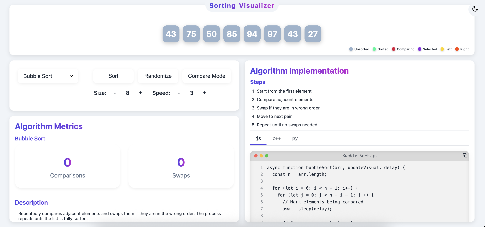
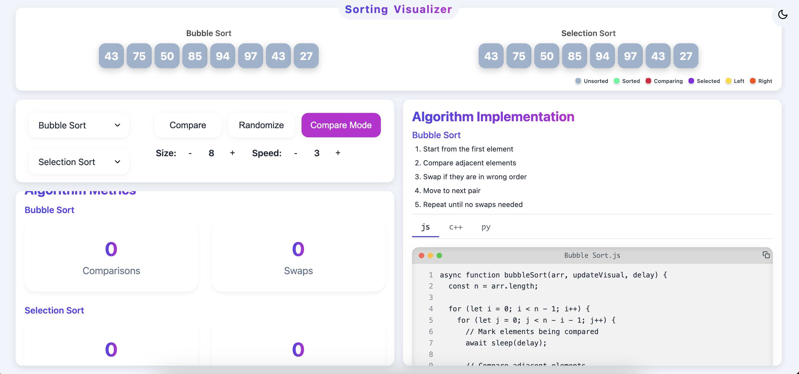

# 🚀 Sorting Visualizer

<p align="center">
  
</p>

<p align="center">
  <a href="#-features"></a>
  <a href="#-tech-stack"></a>
  <a href="#-license"></a>
  <a href ="https://sorting-visualizer-amd.vercel.app/">Demo</a>
</p>

---

## ✨ Features

- 🎨 **Visualize** Bubble, Selection, Insertion, Merge, Quick, and Heap Sort
- 🆚 **Compare** two algorithms side-by-side
- 🌀 **Step-by-step** animation with color-coded states
- 📊 **Metrics**: See comparisons and swaps in real time
- 📚 **Algorithm info**: Complexity, stability, pros/cons, and more
- 💻 **Code viewer**: See and copy JS, C++, and Python implementations
- 🌗 **Dark/Light mode** toggle
- 📱 **Responsive**: Works great on mobile and desktop

---

## 📸 Screenshots

<div align="center">

**Single Algorithm Mode**



**Compare Mode**



</div>

---

## 🚀 Getting Started

1. **Clone the repo:**
   ```sh
   git clone https://github.com/your-username/sorting-visualizer.git
   cd sorting-visualizer
   ```
2. **Install dependencies:**
   ```sh
   npm install
   ```
3. **Run in development:**
   ```sh
   npm run dev
   ```
   Open [http://localhost:5173](http://localhost:5173) in your browser.

4. **Build for production:**
   ```sh
   npm run build
   ```
5. **Preview production build:**
   ```sh
   npm run preview
   ```

---

## 🛠️ Tech Stack

- ⚛️ [React](https://react.dev/)
- ⚡ [Vite](https://vitejs.dev/)
- 🎨 [CSS3](https://developer.mozilla.org/en-US/docs/Web/CSS)
- 🖼️ [React Icons](https://react-icons.github.io/react-icons/)

---

## 📚 Learn More

- [Sorting Algorithms (GeeksforGeeks)](https://www.geeksforgeeks.org/sorting-algorithms/)
- [React Documentation](https://react.dev/)
- [Vite Documentation](https://vitejs.dev/)

---

## 🙏 Credits

- Inspired by classic sorting visualizer projects and the open-source community.
- Icons by [React Icons](https://react-icons.github.io/react-icons/).

---

## 📄 License

MIT

---

<p align="center">
  <b>⭐️ Star this repo if you like it! | Made with ❤️ by Aman Thakur</b>
</p>

